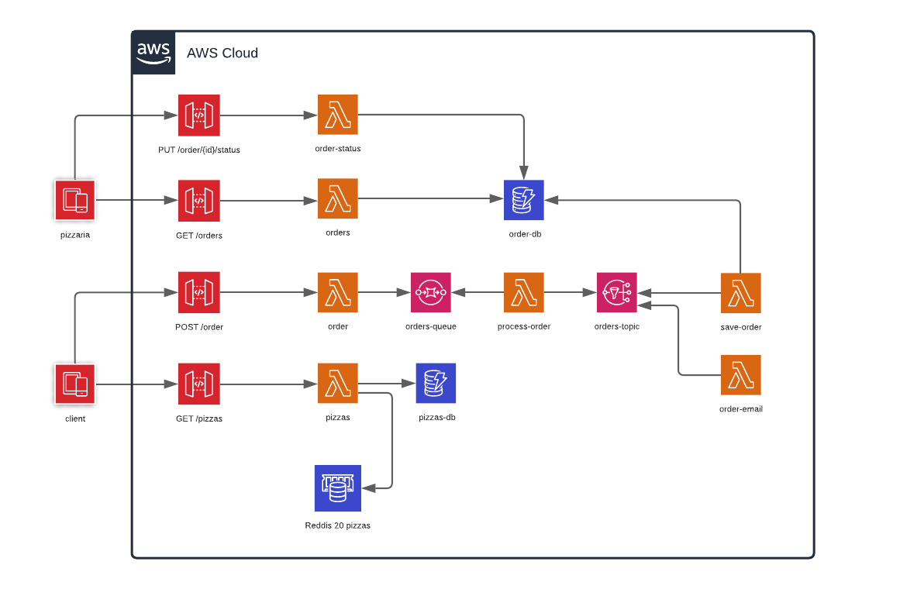

# Python Serverless Offline

Este projeto é apenas um caso de estudo de como simular o ambiente da aws
localmente, integrando serverless-offline com python. 

## Necessário

- Docker
- Aws Cli

## Desenho da arquitetura

Abaixo temos toda a comunicação dos recursos contidos neste projeto.


 
## Rodando o projeto.

###1. Subindo os serviços da aws.


Dentro da pasta `infra` execute o comando abaixo para montar os containers com o docker-compose.

```bash
$ docker-compose -f aws-localstack.yaml --env-file ../.env up -d
```
> *NOTE:* Se estiver executando em uma máquina com distribuição linux lembre de alterar o hostname no arquivo .env de `host.docker.internal` para `localhost`.

###Subindo o serviço do Serverless Offline.

Se for a primeira vez que vai executar basta rodar o comando abaixo para que ele gere o build da imagem e suba o container.

```bash
$ docker-compose build && docker-compose up
```

Se adicionar uma nova dependência.

```bash
$ docker-compose build --no-cache && docker-compose up
```


## Postman Collection

Para que você possa interagir com a aplicação, na pasta `docs` existe uma coleção do postman.


## Gerar zip das lambdas

```bash
$ juni build
```

##Testes

Para executar um teste gravando todos os dados da requisição com o vcr.

```bash
$ docker exec -it <ID OU NOME DO CONTAINER> pytest --record-mode=rewrite tests/hello.py
```

Para executar os testes utilizando os dados gravados e bloqueando a camada de rede.

```bash
$ docker exec -it <ID OU NOME DO CONTAINER> pytest --block-network tests/hello.py
```

Para executar os testes com cobertura de testes gerando um relatório em html.

```bash
$ docker exec -it <ID OU NOME DO CONTAINER> pytest --block-network --cov-config .coveragerc --cov src --cov-report html tests/hello.py
```

##Documentação and Bibliotecas

- https://github.com/localstack/localstack
- https://www.serverless.com/framework/docs
- https://docs.docker.com/docker-for-mac/networking
- https://pypi.org/project/juniper
- https://pytest-cov.readthedocs.io/en/latest
- https://pypi.org/project/pytest-vcr
- https://boto3.amazonaws.com/v1/documentation/api/latest/guide/quickstart.html


